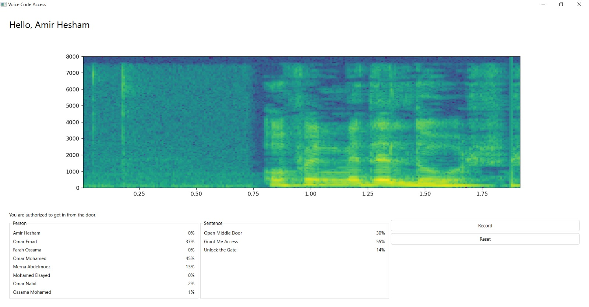

# Voice Authentication System

## Overview

Welcome to the Voice Authentication System project! This system is designed to provide a robust and secure method of authenticating individuals based on their voice. The project involves the detection of a person's identity and the verification of a spoken sentence to enhance security measures.

## Table of Contents

1. [Introduction](#introduction)
2. [Features](#features)
3. [Installation](#installation)
4. [Usage](#usage)
5. [Dependencies](#dependencies)
6. [Contributing](#contributing)

## Introduction

Voice Authentication System is an innovative project that utilizes advanced voice recognition technology to authenticate individuals. It focuses on two primary aspects:

- **Person Detection:**
  - Utilizes advanced voice recognition algorithms to identify individuals.
  - Analyzes unique vocal patterns and characteristics for accurate person detection.

- **Sentence Verification:**
  - Implements a secure method for verifying the authenticity of a spoken sentence.
  - Ensures a high level of accuracy in sentence recognition to enhance security.

- **User-Friendly Interface:**
  - Provides a simple and intuitive interface for easy interaction.
  - Offers clear instructions for users to follow during the authentication process.

- **Security Measures:**
  - Implements encryption and secure communication protocols to protect sensitive voice data.
  - Regularly updates security features to address emerging threats.

## Project UI


## Features

- **Person Detection**
- **Sentence Verification**
- **User-Friendly Interface**
- **Security Measures**

## Installation

Follow these steps to set up the Voice Authentication System on your local machine:

```bash
git clone https://github.com/your-username/voice-authentication-system.git
cd voice-authentication-system
pip install -r requirements.txt
python main.py
```
## Usage

1. **Launch the application and follow the on-screen instructions.**
2. **Enroll users by capturing their voice samples for person detection.**
3. **Set up sentence verification for each enrolled user.**
4. **Use the system to authenticate users based on their voice.**

## Dependencies

The Voice Authentication System relies on the following key dependencies:

- [Python](https://www.python.org/): Programming language used for development.
- [SpeechRecognition](https://pypi.org/project/SpeechRecognition/): Library for speech recognition.
- [scikit-learn](https://scikit-learn.org/): Machine learning library for person detection.

For a complete list of dependencies, refer to the `requirements.txt` file.

## Contributing

Contributions to the Voice Authentication System project are welcome! Follow these guidelines to contribute:

1. Fork the repository.
2. Create a new branch for your feature or bug fix.
3. Make your changes and submit a pull request.
4. Ensure your code adheres to the project's coding standards.
